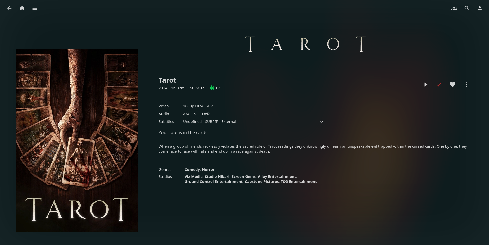
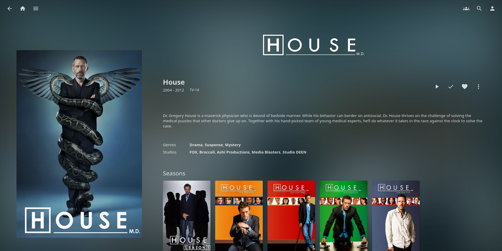
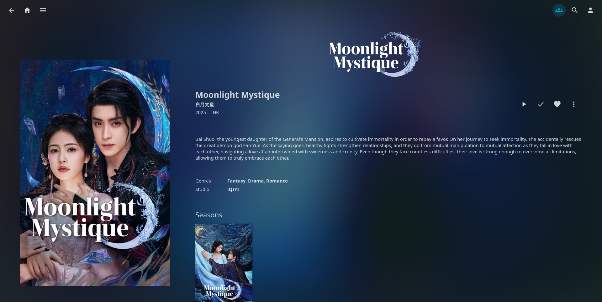
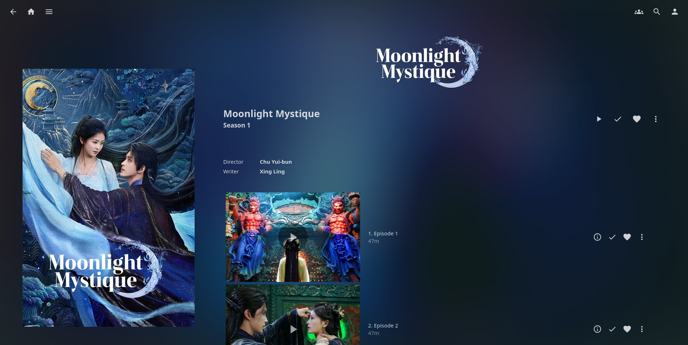
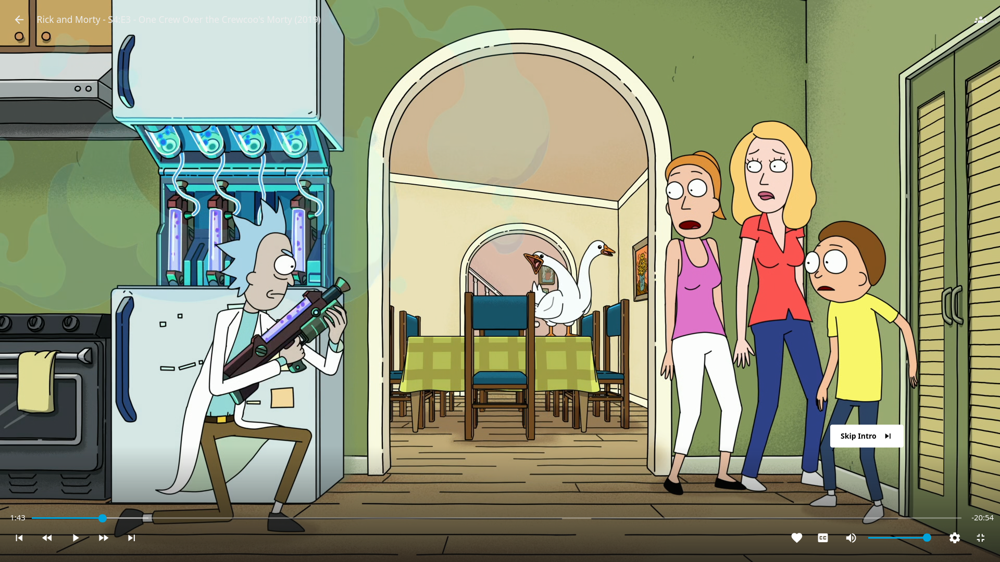

# Hint of Green

A clean, subtle Jellyfin CSS theme with a familiar feel and a modern twist.

## Overview

Hint of Green is my first attempt at a Jellyfin CSS theme. The goal was to create something fresh, something nice to use everyday.

As of **November 2025**, this theme has been updated to support the latest version of Jellyfin.

## Compatibility
- Tested on **Chrome**, **Firefox**, **Safari**, and common Jellyfin applications
- Compatible with **Jellyfin 10.11.2** and later

## Features
- Inspired by the palette of a well-known community theme, with its own unique twist.
- Looks especially good with **backdrops enabled**.
- Designed with support for multiple plugins, including the IAmParadox27's Media Bar and ConfusedPolarBear's Intro Skipper plugins.

> Note: Earlier theme color and video playback variations have been seperated and refined to keep the experience consistent and lightweight. See the colours section for implementing colours for Jellyfin.

## Installation (Main)
There will be two channels, one stable and one nightly. It is always ideal to use the stable version if you are deploying to a large amount of people. But if you like to be risky, feel free to use the nightly version. I will merge nightly into stable once I feel the nightly version is performing well enough.
Copy this code into Dashboard > General > Custom CSS
#### Stable:
```css
@import url('https://looi-wh.github.io/HintOfGreenCSS/theme.css');
```
or
#### Tester/Nightly (deprecated, no longer updated):
```css
@import url('https://looi-wh.github.io/HintOfGreenCSS/themeNightly.css');
```
## Colours
The default CSS sticks to the original Jellyfin blue. This is intentional.
Add any one of the following for a new look.
Copy this code into Dashboard > General > Custom CSS
#### Green (ORIGINAL)
```css
@import url('https://looi-wh.github.io/HintOfGreenCSS/flavours/originalGreen.css');
```
#### Pink
```css
@import url('https://looi-wh.github.io/HintOfGreenCSS/flavours/Pink.css');
```

## Nginx (Optional)
If you are using nginx as a reverse proxy for Jellyfin, replace the "add_header Content-Security-Policy" in your nginx config with this line below
```shell
add_header Content-Security-Policy "default-src https: data: blob: http://image.tmdb.org; style-src 'self' 'unsafe-inline' https://looi-wh.github.io ; script-src 'self' 'unsafe-inline' https://www.gstatic.com/cv/js/sender/v1/cast_sender.js https://www.youtube.com blob:; worker-src 'self' blob:; connect-src 'self'; object-src 'none'; frame-ancestors 'self'";
```

## Force backdrop for all users (Optional)
This theme heavily rely on Jellyfin's backdrop. To forcefully enable backdrop for Jellyfin, visit this [github repo](https://github.com/looi-wh/jellyfin-force-backdrop).

## Images
Home Page (With Media Bar Plugin)
.png)

Movie Detail Page


Movie Detail Page


Movie Detail Page


Series Detail Page


Series Session Detail Page


Skip Intro Theming

