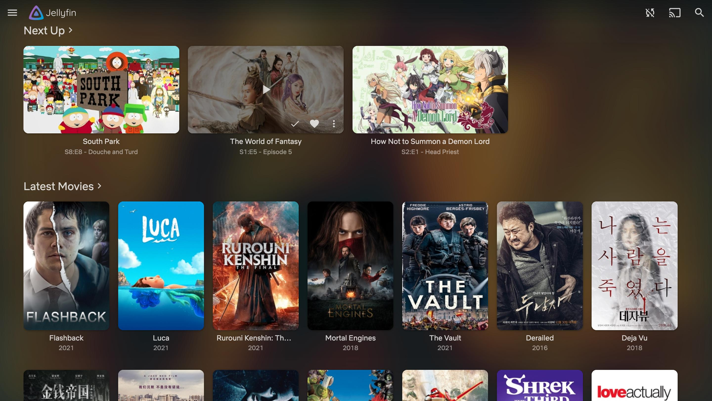
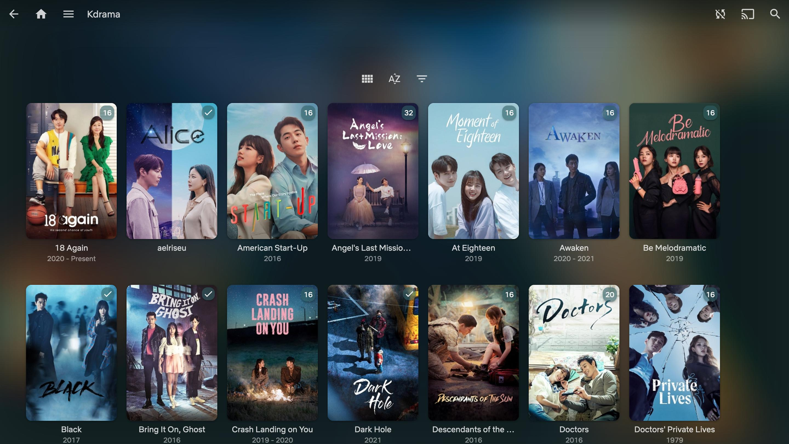
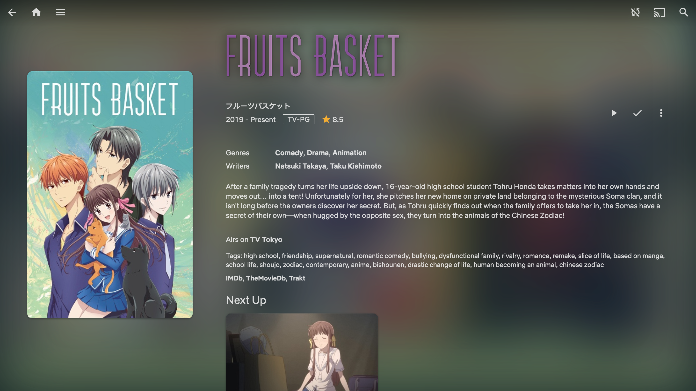
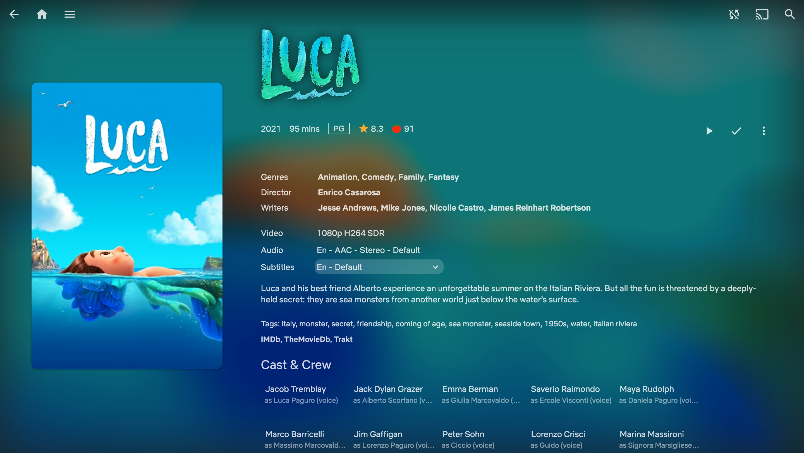
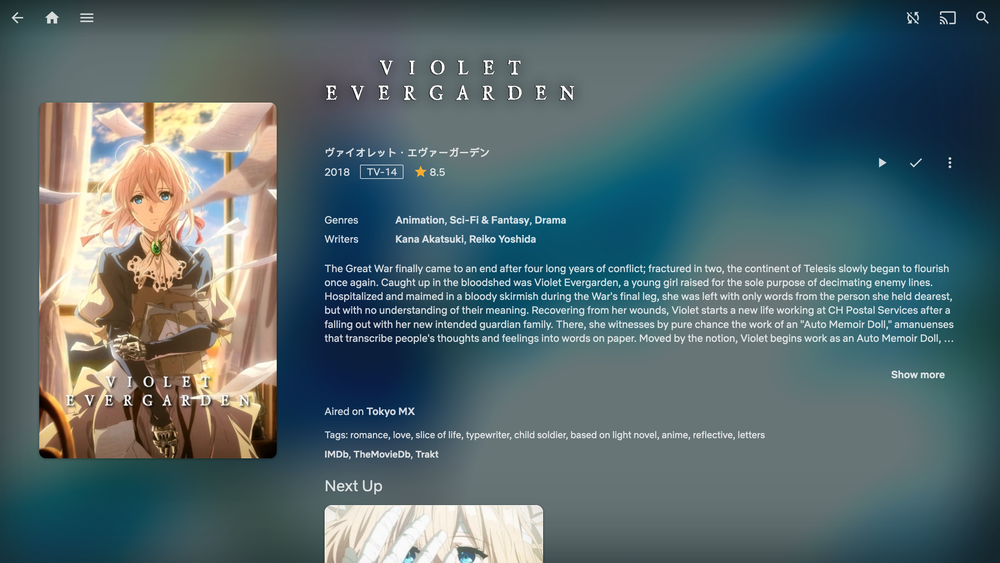
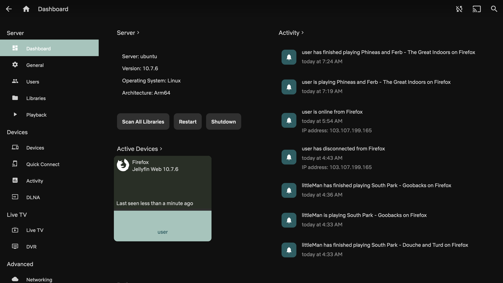
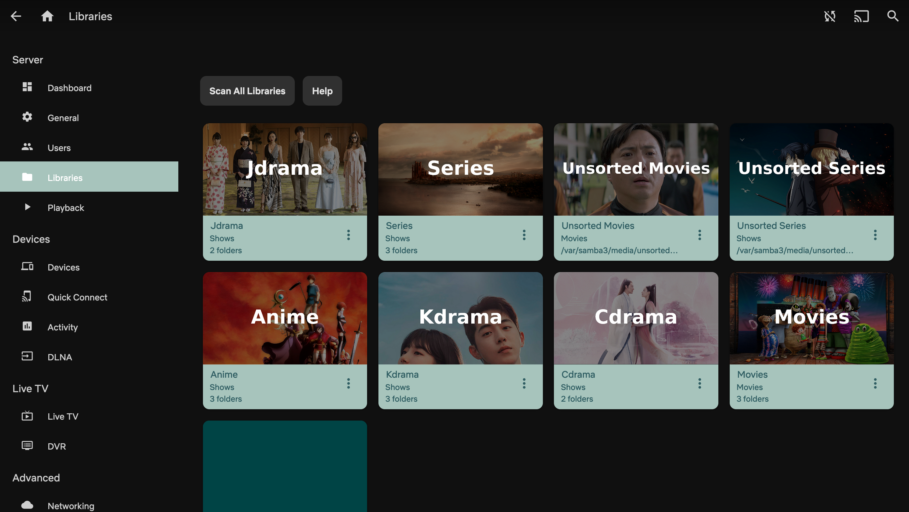
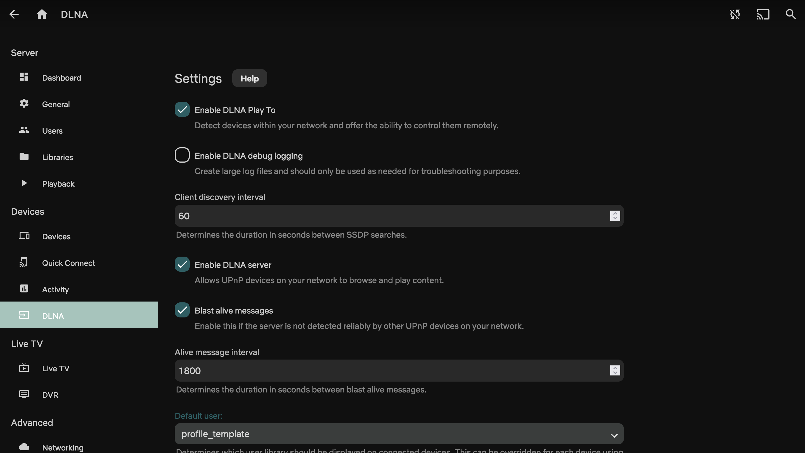

# Hint of Green
Jellyfin CSS Theme

Sort of my first try on a css template. When I first designed this template, I tried my best to design something new but familar. I wanted something that is different from the other masterpiece that the other wizards have created.

## Tested on
- Chrome, Firefox, Safari and common Jellyfin applications
- Jellyfin 10.6 - 10.7.7

## Features
- Colours are based on a popular template
- Little spinkle of green everywhere, but never too much
- Lighter theme for video playback (better if you see for yourself)
- Disabled blurring on Safari (browser performance issues)
- Better support for mobile devices
- Works extremely beautiful with backdrop enabled
- Some playful colouring at unexpected places (you will like it)

This theme can be considered as heavy, but of course there some css will disable by itself if certain unfavourable conditions are met.

## Installation
There will be two channels, one stable and one nightly. It is always ideal to use the stable version if you are deploying to a large amount of people. But if you like to be risky, feel free to use the nightly version. I will merge nightly into stable once I feel the nightly version is performing well enough.
Copy this code into Dashboard > General > Custom CSS
#### Stable:
```css
@import url('https://looi-wh.github.io/HintOfGreenCSS/theme.css');
```
or
#### Tester/Nightly:
```css
@import url('https://looi-wh.github.io/HintOfGreenCSS/themeNightly.css');
```

## To enable fanart/logo
- Install the Fanart plugin first
- Go to Dashboard > Library
- For each library you have, go to Manage Library
- Enable Fanart for image fetcher
- Then go to Fetcher Settings and select "Logo"
- Manually scan media library
- Refresh the page once done

## Nginx
If you are using nginx as a reverse proxy for Jellyfin, replace the "add_header Content-Security-Policy" in your nginx config with this line below
```
add_header Content-Security-Policy "default-src https: data: blob: http://image.tmdb.org; style-src 'self' 'unsafe-inline' https://looi-wh.github.io ; script-src 'self' 'unsafe-inline' https://www.gstatic.com/cv/js/sender/v1/cast_sender.js https://www.youtube.com blob:; worker-src 'self' blob:; connect-src 'self'; object-src 'none'; frame-ancestors 'self'";
```

## Images
Login Page


Home Page - rounded corners and slight shadow for looks


Home Page 2 - vertical listing instead of horizontal


Home Page 3 - green accenting


KDrama


Item Details - large item picture at the left to entice user and item description on the right for more details


Item Details 2


Item Details 3


Item Details 4


Item Details 5 (No Fan Art) - an example if fan art isnt enabled
.png)

More Like This - example


Episode Lists - smaller height picture for a more compressed look


Playback - top and bottom transparency with slight shadow gradient for a more morden feel


DashBoard - different shades of green accenting so it wont look boring


DashBoard Library


DashBoard DLNA


HomePage Safari - No Backdrop, due to poor browser blurring support
.jpg)
